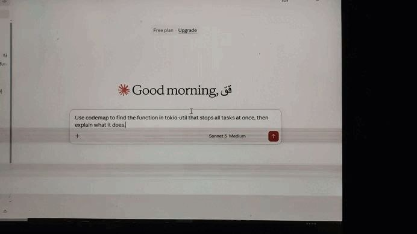

# codemap

Local-first semantic code search for Rust projects. Ask a question in plain
English and get file and line answers. Everything runs on your machine:
no cloud, no API keys, no code leaves your laptop.



```bash
codemap ask ./my-project "stop a running task"
```

```
 0.032  src/task/join_map.rs:829  JoinMap<K, V, S>::abort_all
 0.030  src/task/join_map.rs:660  JoinMap<K, V, S>::abort_matching
```

Note that the question says "stop" while the code says "abort". Keyword
search cannot bridge that gap; embeddings can.

## Commands

| Command | What it does |
|---|---|
| `codemap list <path>` | List all functions |
| `codemap callers <path> <name>` | Who calls this function? |
| `codemap index <path>` | Pre-build the semantic index |
| `codemap ask <path> "<question>" [--mode lexical\|semantic\|hybrid]` | Search |
| `codemap eval <path>` | Benchmark the three search modes |


## Use with Claude Desktop

Add to `claude_desktop_config.json`:

```json
{
  "mcpServers": {
    "codemap": {
      "command": "C:\\path\\to\\codemap.exe",
      "args": ["serve", "C:\\path\\to\\your\\project"]
    }
  }
}
```

Then ask: *"Use codemap to find the function in tokio-util that stops all tasks at once, then explain what it does."*

## How it works

1. **tree-sitter** parses each `.rs` file into functions, their owning
   type, doc comments (`///`), and the functions they call.
2. Each function becomes a text (type + name + docs + first 400 chars of
   the body) embedded locally with `all-MiniLM-L6-v2` (ONNX, CPU only,
   ~86 MB downloaded once).
3. Vectors are cached in `.codemap/` and rebuilt only when code changes.
4. Search modes: keyword scoring, cosine similarity over embeddings, and a
   hybrid using weighted Reciprocal Rank Fusion.

## Evaluation

Benchmark: 8 hand-written questions on `tokio-util` (619 functions).
A question counts as answered if an accepted function name appears in the
top N results. Questions were written before looking at results.

| Mode | top-1 | top-3 | top-5 |
|---|---|---|---|
| lexical | 12% | 50% | 50% |
| semantic (name + body) | 62% | 62% | 75% |
| semantic (+ doc comments) | 62% | 75% | 87% |
| hybrid (+ doc comments) | 62% | 62% | 62% |

Findings:
- Embeddings raise top-1 from 12% to 62% over keyword search.
- Indexing doc comments improved semantic top-5 from 75% to 87%.
- Hybrid search did **not** beat semantic-only in this sample.

Performance: 619 functions parsed in ~240 ms; first-time embedding takes
~40 s; later queries answer in ~0.4 s using the cached index.

## Limitations

- The benchmark is small (8 questions, 1 project); one question is 12.5%,
  so differences between modes are not statistically meaningful.
- Rust only. `callers` matches by function name, not by type.
- Test, bench and `target/` directories are ignored.
- The embedding model is general-purpose, not code-specific.

## Roadmap

- [x] Function extraction, call graph, keyword search
- [x] Local embeddings with on-disk cache
- [x] Doc-comment indexing
- [x] Evaluation harness
- [ ] File watcher for incremental updates
- [x] MCP server for AI agents
- [ ] Larger benchmark across several projects